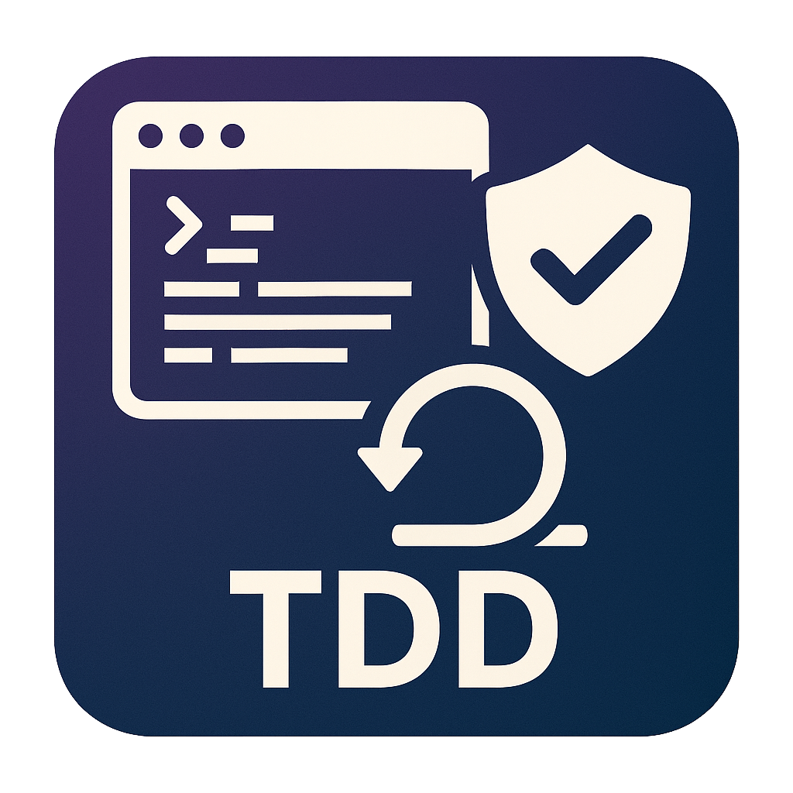

<!-- Improved compatibility of back to top link: See: https://github.com/othneildrew/Best-README-Template/pull/73 -->

<a id="readme-top"></a>

<!--
*** Thanks for checking out the Best-README-Template. If you have a suggestion
*** that would make this better, please fork the repo and create a pull request
*** or simply open an issue with the tag "enhancement".
*** Don't forget to give the project a star!
*** Thanks again! Now go create something AMAZING! :D
-->

<!-- PROJECT SHIELDS -->
<!--
*** I'm using markdown "reference style" links for readability.
*** Reference links are enclosed in brackets [ ] instead of parentheses ( ).
*** See the bottom of this document for the declaration of the reference variables
*** for contributors-url, forks-url, etc. This is an optional, concise syntax you may use.
*** https://www.markdownguide.org/basic-syntax/#reference-style-links
-->

[![Contributors][contributors-shield]][contributors-url]
[![Forks][forks-shield]][forks-url]
[![Stargazers][stars-shield]][stars-url]
[![Issues][issues-shield]][issues-url]
[![GNU GENERAL PUBLIC LICENSE][license-shield]][license-url]
[![LinkedIn][linkedin-shield]][linkedin-url]

<!-- PROJECT LOGO -->
<br />
<div align="center">
  <a href="https://github.com/tonkatommy/MRHQ-L5-Mission-2-Team-3">
    
  </a>

<h3 align="center">Mission 2 - Turners Car Insurance API</h3>

  <p align="center">
    This project focuses on the backend development of a modular insurance purchasing system, built around four RESTful APIs.
    <br />
    <a href="https://github.com/tonkatommy/MRHQ-L5-Mission-2-Team-3"><strong>Explore the docs »</strong></a>
    <br />
    <br />
    <a href="https://github.com/tonkatommy/MRHQ-L5-Mission-2-Team-3">View Demo</a>
    &middot;
    <a href="https://github.com/tonkatommy/MRHQ-L5-Mission-2-Team-3/issues/new?labels=bug&template=bug-report---.md">Report Bug</a>
    &middot;
    <a href="https://github.com/tonkatommy/MRHQ-L5-Mission-2-Team-3/issues/new?labels=enhancement&template=feature-request---.md">Request Feature</a>
  </p>
</div>

<!-- TABLE OF CONTENTS -->
<details>
  <summary>Table of Contents</summary>
  <ol>
    <li>
      <a href="#about-the-project">About The Project</a>
      <ul>
        <li><a href="#built-with">Built With</a></li>
      </ul>
    </li>
    <li>
      <a href="#getting-started">Getting Started</a>
      <ul>
        <li><a href="#prerequisites">Prerequisites</a></li>
        <li><a href="#installation">Installation</a></li>
      </ul>
    </li>
    <li><a href="#usage">Usage</a></li>
    <li><a href="#roadmap">Roadmap</a></li>
    <li><a href="#contributing">Contributing</a></li>
    <li><a href="#license">License</a></li>
    <li><a href="#contact">Contact</a></li>
    <li><a href="#acknowledgments">Acknowledgments</a></li>
  </ol>
</details>

<!-- ABOUT THE PROJECT -->

## About The Project

[![Product Name Screen Shot][product-screenshot]](https://example.com)

# Insurance API Development with TDD

This project focuses on the backend development of a modular insurance purchasing system, built around four RESTful APIs. Each API represents a critical step in the user journey—from quote generation to policy confirmation—and will be developed using Agile practices, specifically Test-Driven Development (TDD).

## Technical Scope

- **Architecture**: RESTful APIs designed for scalability and clarity
- **Development Approach**: Test-Driven Development (TDD) to ensure reliability and maintainability
- **Deployment Options**: APIs may be hosted locally or deployed to the cloud, based on developer preference

## Team Structure

- Up to **4 developers**, each responsible for:
  - One API module
  - Its corresponding unit and integration test cases
- If UX Designers are assigned to the team:
  - They will be included in **Daily Standups**
  - Collaboration will focus on aligning backend functionality with frontend experience

## API Responsibilities

Each developer will own the full lifecycle of their assigned API:

- Designing endpoints based on provided specifications
- Writing test cases before implementation (TDD)
- Iterating based on peer feedback and QA results
- Ensuring seamless integration with other APIs in the system

## Goals

- Deliver a robust, test-covered backend system for insurance purchasing
- Foster cross-functional collaboration between developers and UX designers
- Practice Agile principles through daily standups, iterative development, and continuous testing

<p align="right">(<a href="#readme-top">back to top</a>)</p>

### Built With

**Frontend:**

- 
- [![React][React.js]][React-url]

**Backend:**

- 
- 
- 
  <!-- - [![Next][Next.js]][Next-url] -->
  <!-- - [![Bootstrap][Bootstrap.com]][Bootstrap-url] -->
- [![MySQL][MySQL.com]][MySQL-url]
- 

**Cloud Services:**

- 

<p align="right">(<a href="#readme-top">back to top</a>)</p>

<!-- GETTING STARTED -->

## Getting Started

This is an example of how you may give instructions on setting up your project locally.
To get a local copy up and running follow these simple example steps.

### Prerequisites

Ensure you have these tools installed:

- npm
  ```sh
  npm install npm@latest -g
  ```
- nodemon
  ```sh
  npm install -g nodemon
  ```

### Installation & Run

1. Get a free API Key at [https://example.com](https://example.com)
2. Clone the repo
   ```sh
   git clone https://github.com/tonkatommy/MRHQ-L5-Mission-2-Team-3.git
   ```
3. Change directory, install NPM packages, and run
   ```sh
   cd ./MRHQ-L5-Mission-2-Team-3
   npm install
   npm run dev
   ```
4. Enter your API in `.env`
   ```js
   API_KEY = "ENTER YOUR API";
   ```
5. Change git remote url to avoid accidental pushes to base project
   ```sh
   git remote set-url origin tonkatommy/MRHQ-L5-Mission-2-Team-3
   git remote -v # confirm the changes
   ```

<p align="right">(<a href="#readme-top">back to top</a>)</p>

<!-- USAGE EXAMPLES -->

## Usage

Use this space to show useful examples of how a project can be used. Additional screenshots, code examples and demos work well in this space. You may also link to more resources.

_For more examples, please refer to the [Documentation](https://example.com)_

<p align="right">(<a href="#readme-top">back to top</a>)</p>

<!-- ROADMAP -->

## Roadmap

- [x] Schedule daily standups and sprint planning
- [x] Set up initial project structure and testing framework
- [x] Define API specifications for each module
- [x] Assign developers to API modules
- [ ] Integrate UX feedback into API design

See the [open issues](https://github.com/tonkatommy/MRHQ-L5-Mission-2-Team-3/issues) for a full list of proposed features (and known issues).

<p align="right">(<a href="#readme-top">back to top</a>)</p>

<!-- CONTRIBUTING -->

## Contributing

Contributions are what make the open source community such an amazing place to learn, inspire, and create. Any contributions you make are **greatly appreciated**.

If you have a suggestion that would make this better, please fork the repo and create a pull request. You can also simply open an issue with the tag "enhancement".
Don't forget to give the project a star! Thanks again!

1. Fork the Project
2. Create your Feature Branch (`git checkout -b feature/AmazingFeature`)
3. Commit your Changes (`git commit -m 'Add some AmazingFeature'`)
4. Push to the Branch (`git push origin feature/AmazingFeature`)
5. Open a Pull Request

<p align="right">(<a href="#readme-top">back to top</a>)</p>

### Top contributors:

<a href="https://github.com/tonkatommy/MRHQ-L5-Mission-2-Team-3/graphs/contributors">
  
</a>

<!-- LICENSE -->

## License

Distributed under the GNU GENERAL PUBLIC LICENSE.  
See [LICENSE](./LICENSE) for more information.

<p align="right">(<a href="#readme-top">back to top</a>)</p>

<!-- CONTACT -->

## Contact

Tommy Goodman - [@tonkatommy](https://github.com/tonkatommy/) - GitHub  
Shane Chapman - [@shane-chapman-23](https://github.com/shane-chapman-23/) - GitHub  
Thousif - [@thousifnm](https://github.com/thousifnm/) - GitHub  
Peymon Armand - [@PeymonA](https://github.com/PeymonA/) - GitHub

Project Link: [https://github.com/tonkatommy/MRHQ-L5-Mission-2-Team-3](https://github.com/tonkatommy/MRHQ-L5-Mission-2-Team-3)

<p align="right">(<a href="#readme-top">back to top</a>)</p>

<!-- ACKNOWLEDGMENTS -->

## Acknowledgments

- [Mission Ready HQ](https://www.missionreadyhq.com/)
- [Sebin Benjamin](https://www.linkedin.com/in/sebinbenjamin/)

<p align="right">(<a href="#readme-top">back to top</a>)</p>

<!-- MARKDOWN LINKS & IMAGES -->
<!-- https://www.markdownguide.org/basic-syntax/#reference-style-links -->

[contributors-shield]: https://img.shields.io/github/contributors/tonkatommy/MRHQ-L5-Mission-2-Team-3.svg?style=for-the-badge
[contributors-url]: https://github.com/tonkatommy/MRHQ-L5-Mission-2-Team-3/graphs/contributors
[forks-shield]: https://img.shields.io/github/forks/tonkatommy/MRHQ-L5-Mission-2-Team-3.svg?style=for-the-badge
[forks-url]: https://github.com/tonkatommy/MRHQ-L5-Mission-2-Team-3/network/members
[stars-shield]: https://img.shields.io/github/stars/tonkatommy/MRHQ-L5-Mission-2-Team-3.svg?style=for-the-badge
[stars-url]: https://github.com/tonkatommy/MRHQ-L5-Mission-2-Team-3/stargazers
[issues-shield]: https://img.shields.io/github/issues/tonkatommy/MRHQ-L5-Mission-2-Team-3.svg?style=for-the-badge
[issues-url]: https://github.com/tonkatommy/MRHQ-L5-Mission-2-Team-3/issues
[license-shield]: https://img.shields.io/github/license/tonkatommy/MRHQ-L5-Mission-2-Team-3.svg?style=for-the-badge
[license-url]: https://github.com/tonkatommy/MRHQ-L5-Mission-2-Team-3/blob/master/LICENSE.txt
[linkedin-shield]: https://img.shields.io/badge/-LinkedIn-black.svg?style=for-the-badge&logo=linkedin&colorB=555
[linkedin-url]: https://linkedin.com/in/linkedin_username
[product-screenshot]: readme-images/screenshot-turners.png
[Next.js]: https://img.shields.io/badge/next.js-000000?style=for-the-badge&logo=nextdotjs&logoColor=white
[Next-url]: https://nextjs.org/
[React.js]: https://img.shields.io/badge/React-20232A?style=for-the-badge&logo=react&logoColor=61DAFB
[React-url]: https://reactjs.org/
[Vue.js]: https://img.shields.io/badge/Vue.js-35495E?style=for-the-badge&logo=vuedotjs&logoColor=4FC08D
[Vue-url]: https://vuejs.org/
[Angular.io]: https://img.shields.io/badge/Angular-DD0031?style=for-the-badge&logo=angular&logoColor=white
[Angular-url]: https://angular.io/
[Svelte.dev]: https://img.shields.io/badge/Svelte-4A4A55?style=for-the-badge&logo=svelte&logoColor=FF3E00
[Svelte-url]: https://svelte.dev/
[Laravel.com]: https://img.shields.io/badge/Laravel-FF2D20?style=for-the-badge&logo=laravel&logoColor=white
[Laravel-url]: https://laravel.com
[Bootstrap.com]: https://img.shields.io/badge/Bootstrap-563D7C?style=for-the-badge&logo=bootstrap&logoColor=white
[Bootstrap-url]: https://getbootstrap.com
[JQuery.com]: https://img.shields.io/badge/jQuery-0769AD?style=for-the-badge&logo=jquery&logoColor=white
[JQuery-url]: https://jquery.com
[MySQL.com]: https://img.shields.io/badge/mysql-4479A1.svg?style=for-the-badge&logo=mysql&logoColor=white
[MySQL-url]: https://mysql.com
